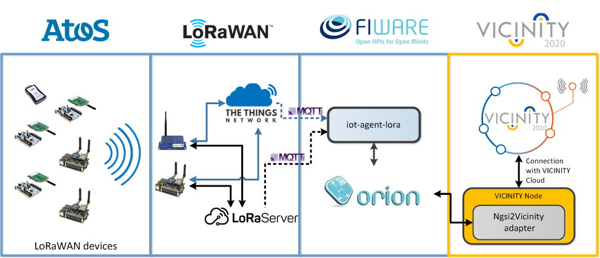

<!--  Copyright (C) 2018 ATOS Spain S.A.
 
 This file is part of VICINITY.
 
 VICINITY is free software: you can redistribute it and/or modify
 it under the terms of the GNU General Public License as published by
 the Free Software Foundation, either version 3 of the License, or
 (at your option) any later version.
 
 VICINITY is distributed in the hope that it will be useful,
 but WITHOUT ANY WARRANTY; without even the implied warranty of
 MERCHANTABILITY or FITNESS FOR A PARTICULAR PURPOSE.  See the
 GNU General Public License for more details.
 
 You should have received a copy of the GNU General Public License
 along with VICINITY.  If not, see <http://www.gnu.org/licenses/>. -->

# FIWARE NGSIv2 API to VICINITY TD adapter

> Adapter that translates between [NGSIv2 API](https://fiware.github.io/specifications/ngsiv2/stable/) and the VICINITY Thing Description. 

## Architecture

In this case, unlike the [Cayenne adapter](https://github.com/vicinityh2020/vicinity-adapter-cayenne/), the information reaches VICINITY through a [FIWARE Orion Context Broker](https://fiware-orion.readthedocs.io/en/master/) instance, as shown in the figure below 

|  | 
|:--:|
| NGSIv2 to VICINITY architecture (from the IoE Lab integration phase) |


## Configuration

Basically, the adapter needs to get connected to the Orion Context Broker, with two main purposes:

1- Discover all the available context elements (i.e. devices) from the Context Broker.
2- Provide a valid adapter endpoint to which all the devices notifications will be addressed to.

For this, the folder `config` contains a sample file (for privacy issues, only dummy data is exposed), config.js.sample. **IMPORTANT: Any user must copy this file on another one, called `config.js`, with a valid configuration**. Let's see what we do have to put: 

```

config.server = {
  /**
   * Deployment mode: 'development' or 'production'
   */
  mode: 'development',
  /**
   * Development server configuration
   */
  development: {
     /**
     * Server listening port (to configure Express)
     */
    port: 10000,  
    /**
     * Sink to send the asynchronous publications (from RZs' Orions)
     */
     subscription_endpoint: 'http://localhost:10000/subscriptions'
    
  }
}
```

At this first part, for the sake of spacing, we have removed the production part (which is exactly the same as the development one). Here, the variable `port` specifies the port through which the server (adapter) will be listening to. Besides, and this is very important, `subscription_endpoint` specifies the URL where the notifications will be addressed to. Important to say that this **must match** to the actual location of the adapter; otherwise, notifications will not reach its destination.


Now it is time to talk about the Orion Context Broker setup

```
  config.orion = {

    /**
     * Orion CB location
     */
    endpoint: 'http://95.211.239.166:1026/v2/',

    /**
     * FIWARE Service attribute
     */
    'fiware-service': 'smartgondor',

    /**
     * FIWARE Service-path attribute
     */
    'fiware-servicepath': '/gardens',
  };
```

We can see its endpoint, and to variables used as part of the queries (they might not be necessary in some off-the-shelf deployments).


After that, the configuration of the adapter (this might remain untouched)

```
  config.adapter = {

    /**
     * Adapter identifier. NOTE: It must match the ID set at the Agent configuration file
     */
      'adapter-id': 'adapter-ngsiv2',

      /**
       * The adapter supports the active discovery, where it is responsible for registering their own devices
       */
      active_discovery: false,

      /**
       * If the active discovery is enabled, the adapter has to 
       */
      agent_endpoint: 'http://localhost:9997/agent/objects',

      /**
       * Before sending the data upon request, it might be possible to assess that it is compliant with Vicinity's TD
       */
      thing_description_validation: false,

      /**
       * If the above option is enabled, 
       */
      validation_endpoint: 'https://vicinity.bavenir.eu:3000/api/repository/validate'

  };
```

Last, but not least, some logging configuration:

```
  config.logging = {
    /**
     * Configures the log level. Appropriate values are: 
     *    silly=0(lowest), debug=1, verbose=2, info=3, warn=4, error=5(highest)
     */
    logLevel: 'debug',
  }
```


## Launching the adapter

  ### 1. Express JS

We have chosen Node JS (Javascript) to implement this adapter. As such, it goes without saying that a Javascript framework must be installed on the system that will run the adapter.

Assuming that this is done, to run the module we have to use the following commands

```
npm install 
npm start

```

  ### 2. Docker (from source code)

Another way of running the code is via [Docker](https://www.docker.com/), a simple yet powerful way to "abstract" the execution of the code from the actual host OS. The way to build a Docker image from the source code is through the following command (obviously, Docker must be installed in the system - tutorial of how to do it [here](https://docs.docker.com/install/)).

```
docker build -t <image_name> .
```

Where `<image_name>` is a label that will identify the created Docker image.  

```
docker run -p 10000:10000 --name=<container_name> <image_name>
```

Where we specify that both host and container will be listening at port **10000**, `<container_name>` is again a label for identifying the running container, and `<image_name>` is the name of the image we had built before.

## API

According to the [Adapter documentation](https://github.com/vicinityh2020/vicinity-agent/blob/master/docs/ADAPTER.md) and [template](https://github.com/vicinityh2020/vicinity-adapter-template), every adapter should expose the following endpoints

`GET /objects` - Returns the list of objects registered at the adapter

`GET /objects/{oid}/properties/{pid}` - Returns last known value and time the value was received by the device. “oid” is UUID of device and “pid” is a property identifier

`PUT /objects/{oid}/properties/{pid}` - Update an oid's property with a given value. Illustrative example below (to show the request body), 

```
curl -X PUT \
  <route-to-adapter>/objects/NGSI-LORA-N003/properties/Temperature \
  -H 'Content-Type: application/json' \
  -d '{
"value": 12054
}'
```

Where we have to address the  `<route-to-adapter>` parameter to the actual location of our adapters (for instance, in the current configuration, it would be `http://localhost:10000/adapter/`)
